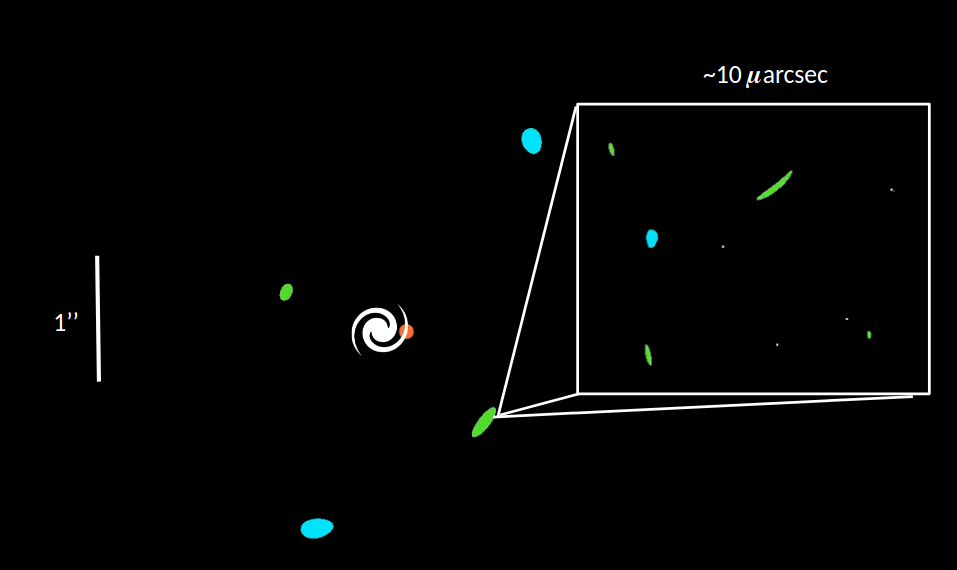
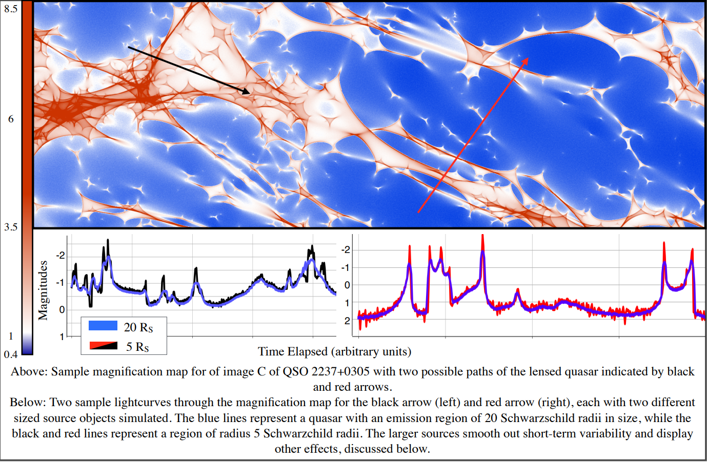
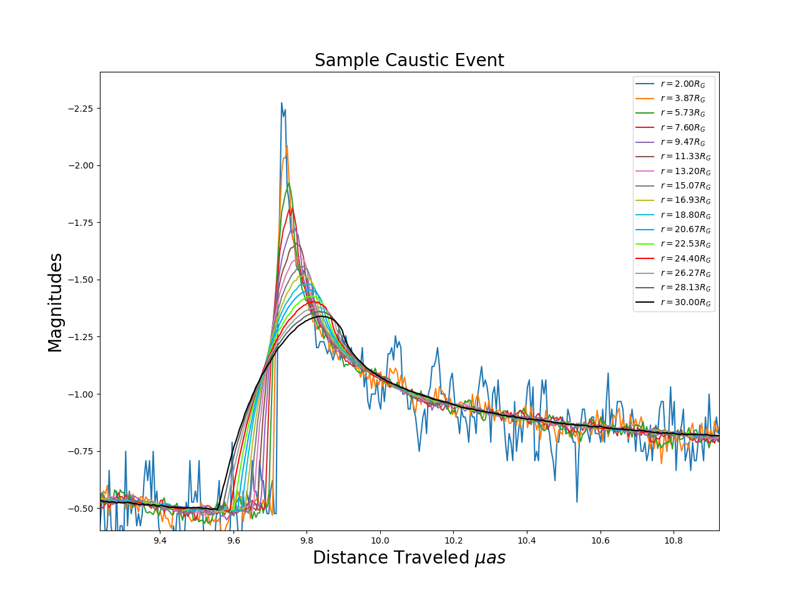

# Mirage2

A simulator for modeling microlensing of gravitationally lensed quasars of arbitrary radius.

Program documentation may be found [here](https://cs.trinity.edu/~jkoeller/Mirage)

Paper accompanying its release detailing the physics [here](https://digitalcommons.trinity.edu/physics_honors/10/).

Conference papers detailing the implementation using Apache Spark may be found [here](https://www.semanticscholar.org/paper/Applications-of-Apache-Spark-TM-for-Numerical-Koeller-Lewis/5acabc9a608872d324934a2ec833723a8c723057) and [here](https://www.semanticscholar.org/paper/Using-Apache-Spark-TM-for-Distributed-Computation-a-Koeller-Lewis/0ef96e757a4e7da8424e903f834a9a636051a4de?p2df).

# Features

`Mirage` is a program for simulating gravitationally lensed quasars, on both the macrolensing scale as well as the microlensing scale. With Mirage, you can specify the parameters of a quasar being gravitationally lensed by a galaxy between the observer and quasar, and then generate animations of the lensed system, light curves, and magnification maps for comparison to physical data.

Mirage simulates gravitationally lensed systems through a ray-tracing approach. Simply put, it traces a specified set of paths of light through the lensing galaxy and discovers which paths successfully connect the observer to the quasar.

Mirage is primarily written in Python, to allow for easy manipulation of the program as well as data analysis through Python’s interpreter. The calculation engine, however, gives you options to specify where the heavy lifting occurs. Mirage may be ran locally using a C/C++ implimentation that can take advantage of graphics processors for the ray-tracing, or may be ran on a computational cluster through the Apache Spark (TM) data analytics framework.

# Mirage in action

  Simulated images of QSO 2237+0305, with a "zoom-in" to the microlensing scale on image C. The swirl in the middle represent the lensing galaxy, while the orange circle is the QSO. Blue and green images show positive- and negative-paritiy lensed images, respectively.
  

  Below: Sample magnification map with two lightcurves at different emission radii.

  

  Below shows a single caustic-crossing event, with the expected lightcurves for a QSO with an emitting region ranging from 2 gravitational radii to 30 radii. One possible application is to measure the relative scale of a QSO's x-ray-emitting region versus a QSO's visble-light-emitting region, by comparing the shift of where differently sized emitting regions occur with observations of a caustic crossing event at differently wavelengths.

  

As an example of the power of Mirage, below is an animation of magnification maps over time, as a lensing galaxy's start orbit around the galaxy's center.

# Installation Details:

MINIMUM REQUIREMENTS:

Most dependencies of mirage will be automatically downloaded during configuration. However, a few tools will be needed to get started:

  - Python 3
  - Python Header files (python-dev)
  - Java 8
  - Scala Build Tool (sbt) (optional)

To install Mirage, run the following commands:

`bash configure`
`make`

If you are a developer and wish to edit the source code, you will need cython, python developer tools, and sbt installed. You can then re-compile the entire project via

`make all`

Lastly, if you would like to make locally hosted documentation and have the sphinx documentation engine installed, running the command

`make docs`

will generate html in the docs/build directory.
